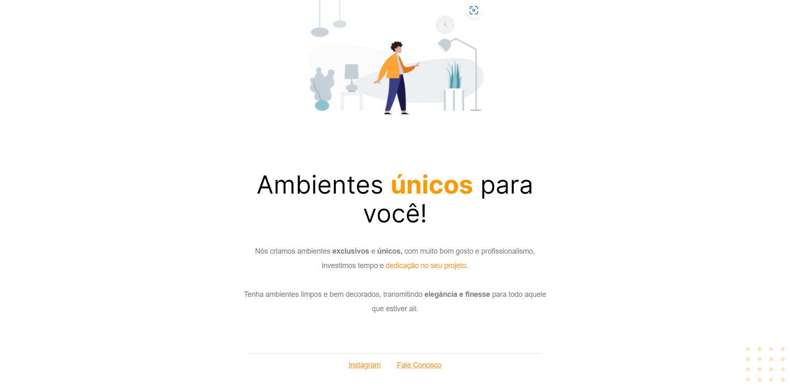

# 📚 Estudos da Trilha Explorer

## 👨‍🔬 Projeto 01

---

[Acesse](https://prdsilva80.github.io/Projeto-01/)

---

## 🛠️ Tecnologias

  

---

## 👨‍🎓 O que aprendi

- Introdução ao HTML
- Introdução ao CSS
- Introdução ao Figma
- Apresentação e posição dos elementos na tela
- Aplicando fontes customizadas e iniciando o CSS
- Trabalhando com cores e fontes
- Alinhando textos e elementos
- Mais ajustes de texto
- Trabalhando com espaçamentos
- Bordas e classificações de elementos
- Posicionamentos de elementos
- Utilizando Codepen
- Utilizando Github

## 📧 Contato

<a href = "mailto:probertos717@gmail.com">